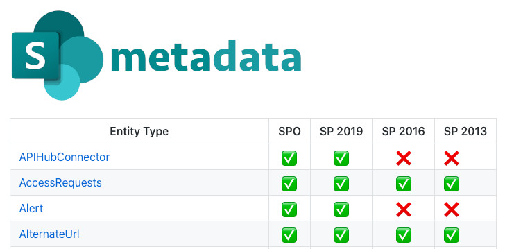

# SharePoint Metadata Tracker

The Metadata Tracker collects SharePoint API entity definitions (`/_api/$metadata`).

[Entity definitions](./meta/README.md) (`edmx` models) are stored in `./meta` folder.

Schema comparison allows tracking "what's new in SharePoint Online" in comparison to previous releases and On-Premise versions.

SharePoint Online is tracked for Standard and Target Releases which allows detecting what potential changes API-terms would be applied shortly.

One of the main goals of the project is providing an easily accessible entry point when planning any backward compatibility of an application to support some of the On-Premise targets or at least verify that some methods/props might require workarounds.

The project should not be treated as documentation as EDMX doesn't provide the corresponding level of details, e.g you can't know GET or POST should be used for a method. And I also do not map everything from EDMX models to `.md`s, it's mostly flat entities and presence comparison within the versions.

## Where to start

Check out 👉 [REST APIs Namespaces](./docs/Namespaces.md) 👈 availability then drill-down to a specific API.

## Similar projects

In a contract to [SharePoint REST API Metadata Explorer](https://github.com/s-KaiNet/sp-rest-explorer) by [Sergei Sergeev](https://github.com/s-KaiNet), which is, by the way, is a great project, SharePoint Metadata Tracker aims to compare APIs availability with the previous SharePoint versions.
